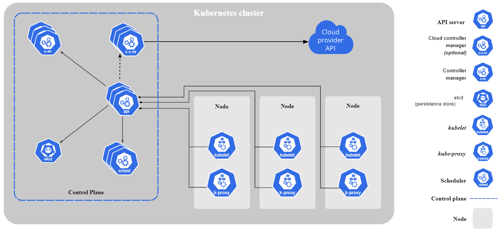

### Made up of control plane/master node  
- Master node has:  
    - ETCD: a key-value store systems that configuration data and entire state of k8s cluster  
    - API SERVER: single entry point for all kubernetes requests
    - CONTROLLER MANAGER: manages k8s resources and other controllers, handle events, 
    - SCHEDULER: assigns pods to nodes, and manages other pod related activites
- Worker nodes has:  
    - KUBE-PROXY: maintains network traffic and ensure pods communication within and outside
    - KUBELET: manages containerized applications in a worker node  
    - PODS: basic exevution unit of a containerized application

